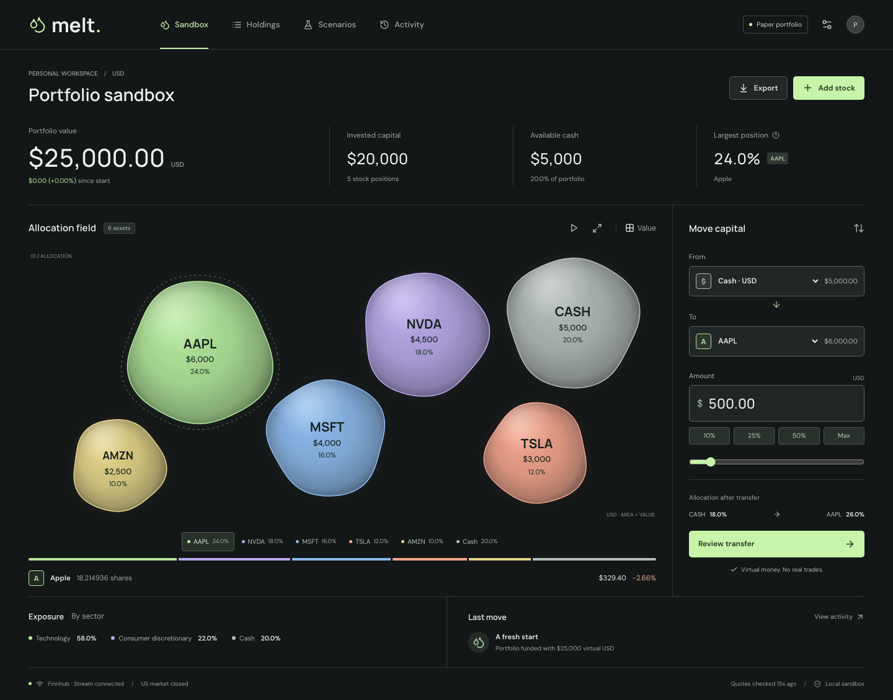
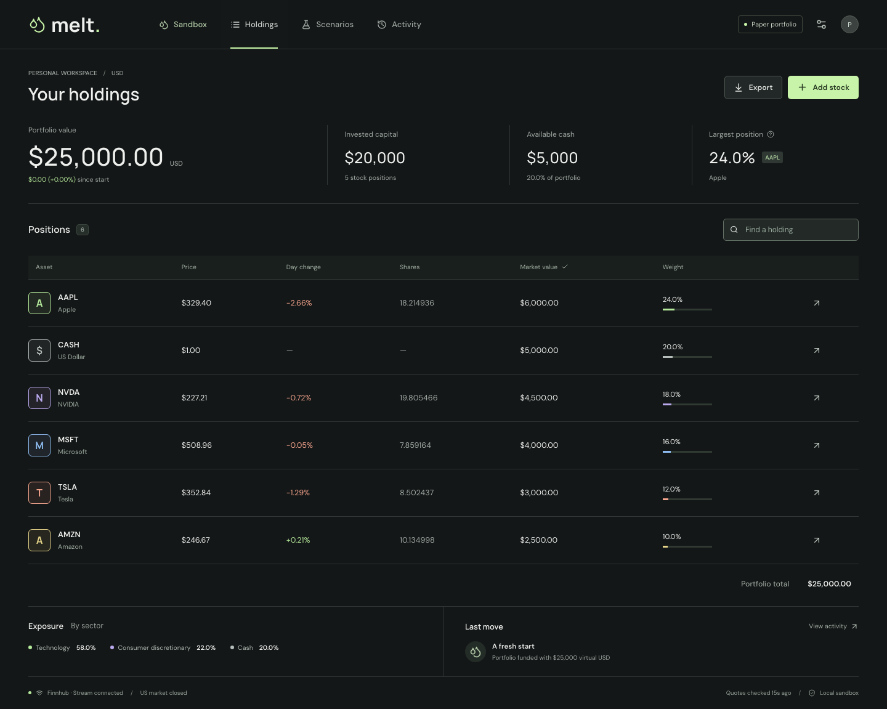
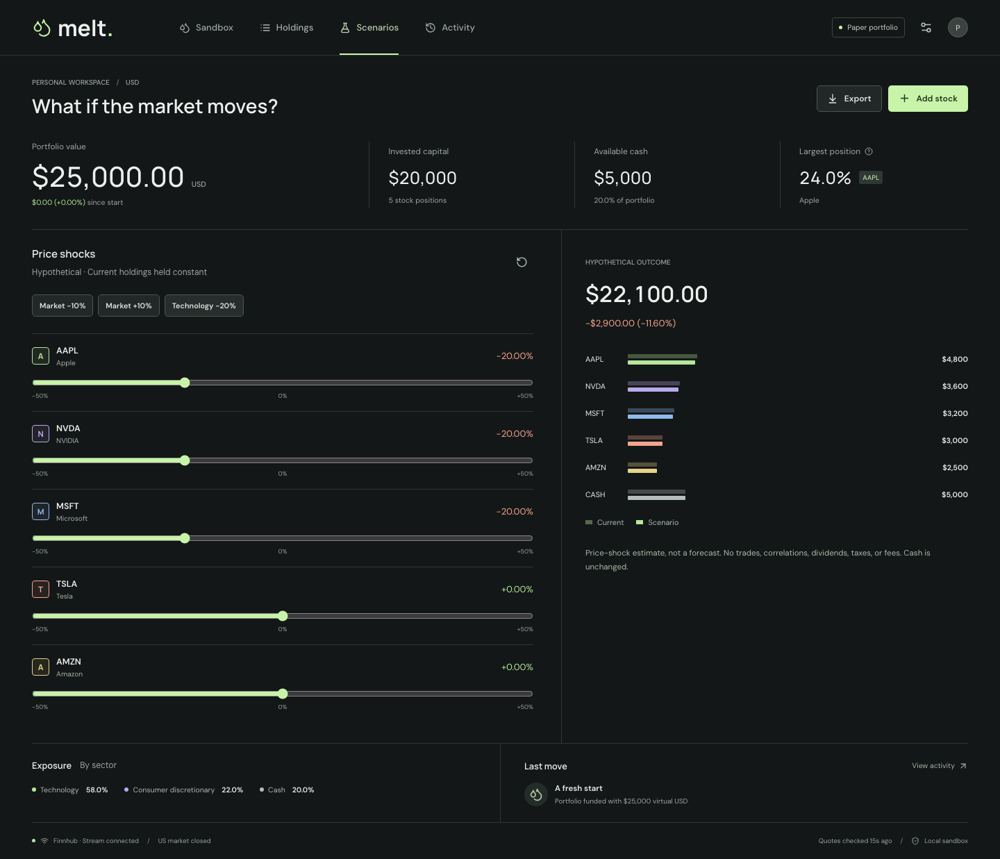
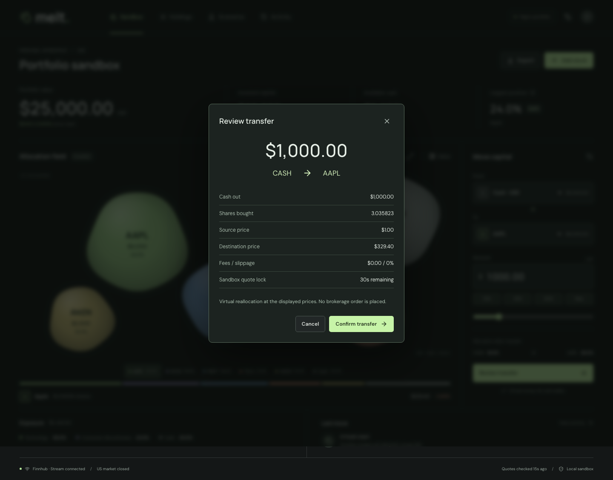
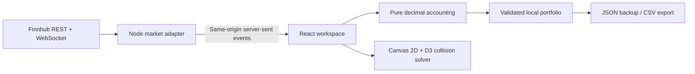

<div align="center">

# Melt

**Market Exposure & Learning Tool**

### Make portfolio allocation tangible.

A real-market, virtual-money workspace where holdings become living slime.
Move capital between assets. See the balance change. Keep the math exact.

[](https://github.com/PhillipVedder/melt-portfolio/actions/workflows/ci.yml)


[](LICENSE)

[Quick start](#quick-start) · [The experience](#the-experience) · [Engineering](#engineering-decisions) · [Verification](#verification) · [Limitations](#deliberate-boundaries)

</div>



**Paper portfolio. Real quotes. No brokerage connection.**

## Why This Exists

MELT stands for **Market Exposure & Learning Tool**: a visual sandbox for understanding portfolio allocation. The name connects the fluid interface to its purpose: explore market exposure and learn through virtual-money experiments.

A portfolio spreadsheet tells you how much you own. It is less good at helping you feel what an allocation decision changes.

Melt explores a different interaction: each position is an organic blob whose **area represents its dollar value**. Drag from one holding to another, review an exact-dollar transfer, then watch the capital move. A familiar holdings table stays one click away. The expressive surface and the conventional financial controls operate on the same accounting model.

This is a clean-room implementation of an original slime-portfolio concept. It was built as an engineering portfolio project, with explicit financial assumptions, security boundaries, and repeatable tests, rather than a mock trading screen.

### Reviewing the Project?

- **Product:** the screenshots below show the actual app; [quick start](#quick-start) runs it locally with your own Finnhub key.
- **Core logic:** start with the [decimal accounting model](src/domain.ts) and its [regression tests](tests/domain.test.ts).
- **System design:** the [architecture notes](docs/ARCHITECTURE.md) explain quote freshness, persistence, transfer invariants, and the server boundary.
- **Evidence:** inspect the [CI runs](https://github.com/PhillipVedder/melt-portfolio/actions), [verification record](docs/QA.md), and [independent review](docs/REVIEW.md), including known limitations.

## The Experience

| Workspace     | Purpose                                                                                                                                            |
| ------------- | -------------------------------------------------------------------------------------------------------------------------------------------------- |
| **Sandbox**   | Proportional slime, stable asset colors, selection, drag-to-stage transfers, exact dollar inputs, allocation preview, pause and recenter controls. |
| **Holdings**  | Searchable positions, value/name sorting, fractional shares, latest price, daily quote change, allocation weights, CSV export.                     |
| **Scenarios** | Independent price shocks for each holding; market-wide and technology-sector presets; before/after exposure. No change to the real portfolio.      |
| **Activity**  | A transfer journal with prices and share quantities recorded in each event; reverse-order undo restores original units.                            |

Supporting features include 12 supported US equities, zero-balance watch positions, sector exposure, validated JSON backups, browser-local persistence, keyboard-accessible forms, native dialogs, and reduced-motion support.

<details>
<summary><strong>More of the product</strong></summary>

### Conventional When It Matters



### Explore Without Committing



### Every Move Has a Review Step



</details>

## Quick Start

**Prerequisites:** Node.js 22.18+ and a [Finnhub API key](https://finnhub.io/register). Quote and streaming availability depend on the account's entitlements.

```bash
git clone https://github.com/PhillipVedder/melt-portfolio.git
cd melt-portfolio
npm ci
cp .env.example .env
# Set FINNHUB_API_KEY in .env. Never prefix it with VITE_.
npm run dev
```

Open **http://127.0.0.1:4317**. The local data service runs on port **4318**.

The starter portfolio is **$25,000 total**, not $25,000 plus stock: $6,000 AAPL, $4,500 NVDA, $4,000 MSFT, $3,000 TSLA, $2,500 AMZN, and $5,000 cash. Stock quantities are calculated from the first valid quote set. No synthetic prices are substituted when the key or provider is unavailable.

The browser never receives the API key. The local Node service calls Finnhub and publishes sanitized snapshots to the app.

### Use It

- Drag one blob onto another to stage 5% of the source value. The ticket remains editable; dragging never executes a transfer.
- Select a holding, hover a destination, and press Space in the canvas for the same staging action. Escape cancels a drag.
- For keyboard or touch-only use, choose **From**, **To**, and **Amount** in the ticket, then **Review transfer**.
- The preview locks the displayed virtual execution prices for 30 seconds. Confirm to apply; cancel leaves holdings unchanged.
- Use **Activity → Undo last transfer** to restore share quantities. A changed market price is not rolled back.
- **Max** transfers all source units, including fractional cents. Ordinary typed amounts remain limited to two decimal places.
- Use **Workspace settings** to back up, import, refresh, or reset the portfolio. A reset/import requires confirmation.

### Build and Run Locally

```bash
npm run build
npm start
# Open http://127.0.0.1:4318
```

Production assets and the data service share one origin. This release is intentionally **local-only**. It is not a public shared-key quote proxy; see [security and deployment](SECURITY.md) before hosting it elsewhere.

## Engineering Decisions



| Decision                           | Why                                                                                                                                                                              |
| ---------------------------------- | -------------------------------------------------------------------------------------------------------------------------------------------------------------------------------- |
| **Decimal arithmetic**             | Dollar transfers and fractional units are computed with `decimal.js`; strings preserve precision in storage. Floating-point conversion is reserved for display and rendering.    |
| **Pure domain functions**          | Funding, preview, transfer, undo, position management, and scenarios are independently testable without React, a browser, or a provider.                                         |
| **One server-side market adapter** | One upstream stream, a shared quote cache, bounded symbol subscriptions, timeout handling, exponential reconnect, and REST fallback avoid duplicating provider work per browser. |
| **Explicit timestamps**            | `tradeAt` is the market event time. `receivedAt` is when the provider was checked. A connected socket is not evidence of a fresh trade.                                          |
| **Canvas plus native controls**    | The visual field is fluid and lightweight; all money-moving actions remain available through labeled HTML controls. D3 handles collision mechanics.                              |
| **Small React state surface**      | No global state framework, generic repository layer, home-grown physics engine, or unnecessary component system.                                                                 |
| **Local-first, not account-based** | No sign-in, analytics, tracking, or backend portfolio database. Backups are explicit and portable.                                                                               |

Read [architecture and accounting](docs/ARCHITECTURE.md), [product decisions](docs/PRODUCT.md), and the [independent review record](docs/REVIEW.md).

## Verification

```bash
npm run check                 # Typecheck, production build, domain/provider tests
npx playwright install chromium
npm run test:e2e              # Deterministic browser tests; no API key required
npm run security:check       # Known-key leak scan of source and built assets
npm audit                    # Dependency advisories
```

Browser tests use **test-only fixtures**, never a production demo-data switch. They cover transfer confirmation, persistence and undo, invalid amounts, stock additions, reset/cancel, scenarios, empty-feed behavior, keyboard focus, accessibility checks, and desktop/tablet/mobile canvas rendering. Canvas checks count painted pixels rather than accepting an empty element as a successful render.

An opt-in smoke test verifies the real provider and refreshes the README screenshots:

```bash
MELT_CAPTURE_LIVE=1 npm run test:e2e -- tests/e2e/live.spec.ts
```

Screenshots document a captured moment, not a current market quote. Test results and remaining verification limits are recorded in [QA.md](docs/QA.md). CI runs the deterministic build and tests without credentials.

## Deliberate Boundaries

- Virtual USD portfolio only. No investment recommendations or real trades.
- No tax-lot accounting, commissions, spreads, slippage, dividends, corporate actions, or exchange calendars. Quote-provider market status may be unavailable; that state is shown as unconfirmed.
- Day change is the **stock's quote change versus its previous close**, not the portfolio's realized daily profit. Since-start change is marked portfolio value minus the initial $25,000, not a time-weighted return.
- Scenarios are deterministic price shocks on current quantities, not risk forecasts or historical backtests.
- Only supported US equities can be added. A general symbol search without currency and exchange validation would imply capabilities this version does not have.
- Tiny positions retain proportionate areas; they do not receive misleading minimum-size blobs. Use the holdings table for precise comparison. A quote outage suppresses allocation graphics until nonzero holdings can be valued.
- This is a single-tab workspace. Concurrent edits from multiple tabs are not transactionally coordinated.
- The journal retains the latest 100 events. Imported events are read-only and cannot execute undo deltas.
- Market data licensing and redistribution are governed by the provider's terms. Public deployment requires separate security and licensing work.

## Project Map

```text
src/
  domain.ts          # Decimal accounting and validation
  usePortfolio.ts    # Browser persistence and feed subscription
  BlobField.tsx      # Proportional canvas and pointer interactions
  components.tsx     # Native dialogs and transfer controls
  App.tsx            # Four workspace views
  styles.css         # Responsive design tokens and layouts
server/
  market.ts          # Finnhub adapter, cache, streaming and polling
  index.ts           # Loopback-only HTTP / SSE service
tests/               # Domain, provider, and browser regression tests
docs/                # Design rationale, review, QA, and screenshots
.github/workflows/   # Credential-free CI
```

## Contributing

See [CONTRIBUTING.md](CONTRIBUTING.md). Keep changes focused, preserve the financial invariants, and include a regression test for bug fixes. The [MIT license](LICENSE) covers this project's code; third-party dependencies retain their own licenses.

See [releases](https://github.com/PhillipVedder/melt-portfolio/releases) for versioned milestones and the [publishing checklist](docs/PUBLISHING.md) for release hygiene.

Built by **[Phillip Vedder](https://github.com/PhillipVedder)** with AI assistance and human product direction. Independent review used the pinned [Ponytail](https://github.com/DietrichGebert/ponytail) review skill; the review record distinguishes suggested improvements, resolved issues, and known limits.
